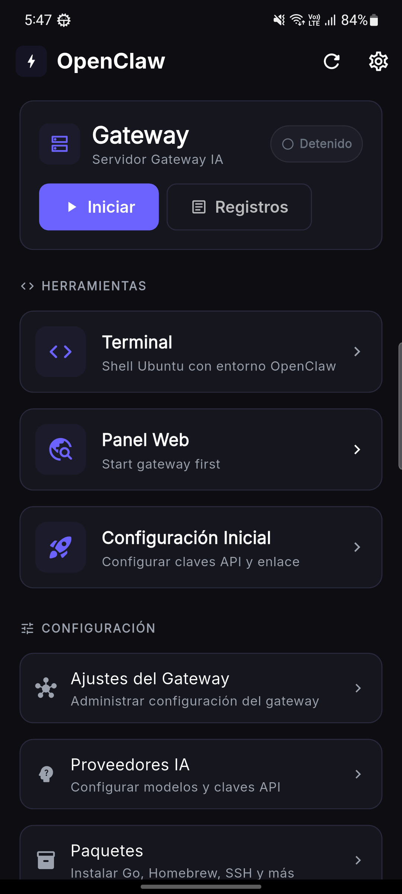
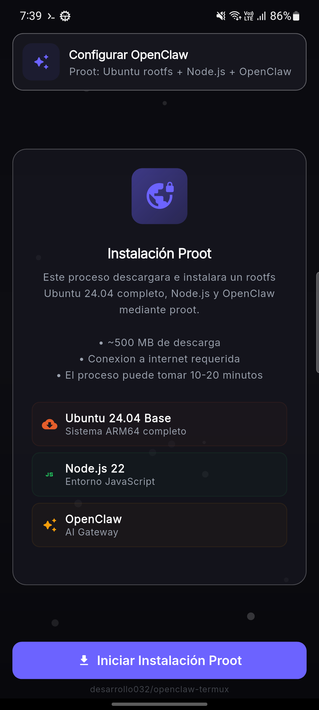
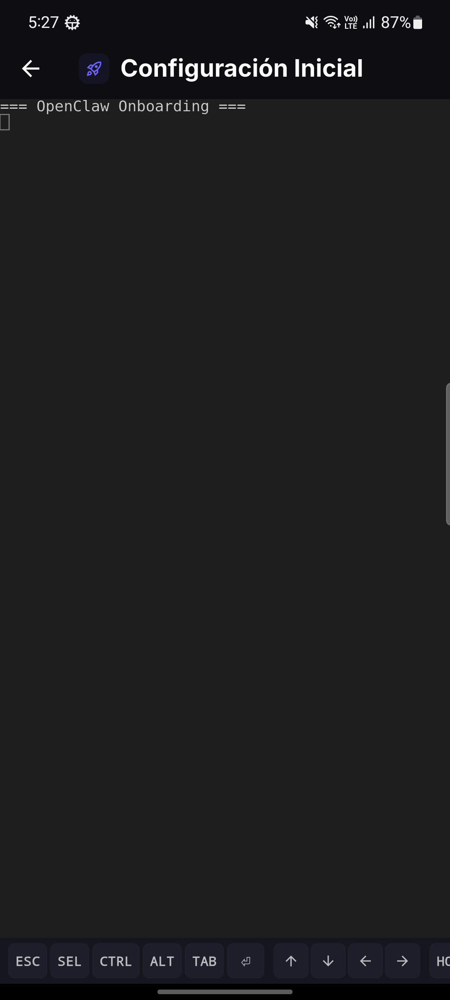
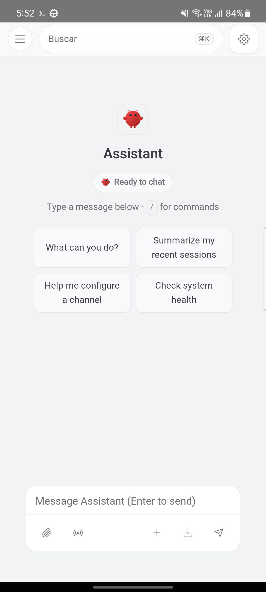
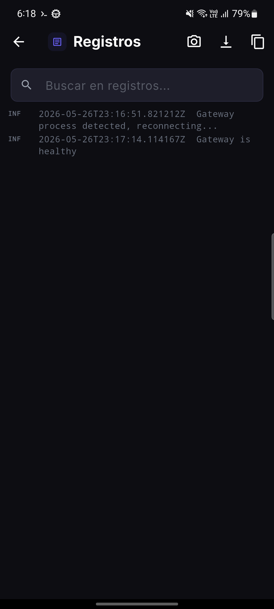
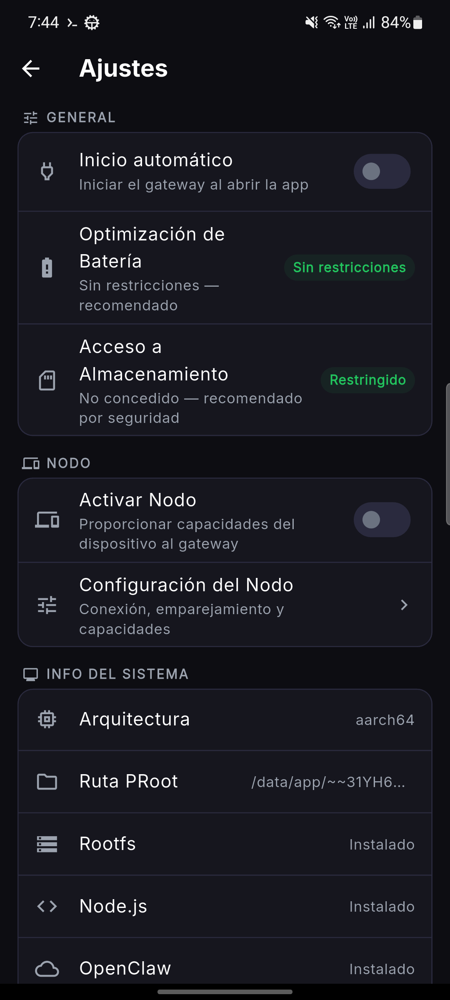

# OpenClaw

[](https://github.com/mithun50/openclaw-termux/releases/latest)
[](https://github.com/mithun50/openclaw-termux/actions/workflows/flutter-build.yml)
[](https://www.npmjs.com/package/openclaw-termux)
[](https://opensource.org/licenses/MIT)
[](https://nodejs.org/)
[](https://www.android.com/)
[](https://flutter.dev/)
[](https://github.com/mithun50/openclaw-termux/pulls)

<p align="center">
  
</p>

> Ejecuta **OpenClaw AI Gateway** en Android — aplicación Flutter autónoma con terminal integrada, panel web, herramientas de desarrollo opcionales y configuración de un toque. También disponible como paquete CLI para Termux.

---

## Capturas de pantalla

<table align="center">
  <tr>
    <td align="center"><br/><b>Panel</b></td>
    <td align="center"><br/><b>Asistente de configuración</b></td>
    <td align="center"><br/><b>Incorporación</b></td>
  </tr>
  <tr>
    <td align="center"><br/><b>Panel Web</b></td>
    <td align="center"><br/><b>Registros</b></td>
    <td align="center"><br/><b>Configuración</b></td>
  </tr>
</table>

---

## ¿Qué es OpenClaw?

OpenClaw lleva la puerta de enlace de IA [OpenClaw](https://github.com/anthropics/openclaw) a Android. Configura un entorno Ubuntu completo a través de proot, instala Node.js y OpenClaw, y proporciona una interfaz nativa de Flutter con control total sobre la gateway y acceso a capacidades del dispositivo (cámara, ubicación, sensor, etc.).

### Dos formas de usar

| | **Aplicación Flutter** (Autónoma) | **CLI de Termux** |
|---|---|---|
| Instalar | Compilar APK o descargar versión | `npm install -g openclaw-termux` |
| Configurar | Tocar "Comenzar configuración" | `openclawx setup` |
| Gateway | Tocar "Iniciar Gateway" | `openclawx start` |
| Terminal | Emulador de terminal integrado | Shell de Termux |
| Panel | WebView integrado | Navegador en `localhost:18789` |

---

## Características

### Aplicación Flutter
- **Configuración de un toque** — Descarga rootfs de Ubuntu, Node.js 22 y OpenClaw automáticamente
- **Terminal integrada** — Emulador de terminal completo con barra de herramientas de teclas extra, copiar/pegar, URLs clicables
- **Controles de Gateway** — Iniciar/detener gateway con indicador de estado y verificaciones de salud
- **Proveedores de IA** — Configurar claves API y seleccionar modelos para 7 proveedores (Anthropic, OpenAI, Google Gemini, OpenRouter, NVIDIA NIM, DeepSeek, xAI)
- **Acceso remoto SSH** — Iniciar/detener servidor SSH, establecer contraseña raíz, ver información de conexión con comandos copiables
- **Menú Configurar** — Ejecutar `openclaw configure` en una terminal integrada para gestionar la configuración de gateway
- **Capacidades de dispositivo de nodo** — 7 capacidades (15 comandos) expuestas a IA a través del protocolo de nodo WebSocket
- **Pantalla de URL de token** — Captura token de autenticación desde incorporación, lo muestra con botón de copia
- **Panel Web** — WebView integrado carga el panel con token de autenticación
- **Ver registros** — Visor de registros de gateway en tiempo real con búsqueda/filtro
- **Incorporación** — Configurar claves API y vinculación directamente en la aplicación
- **Paquetes opcionales** — Instalar Go (Golang), Homebrew y OpenSSH como herramientas de desarrollo opcionales
- **Configuración** — Inicio automático, optimización de batería, información del sistema, estado del paquete, reejecutar configuración
- **Servicio de primer plano** — Mantiene la gateway activa en segundo plano con seguimiento de tiempo activo
- **Notificaciones de configuración** — Notificaciones de barra de progreso durante la configuración del entorno

### Paquetes opcionales

Después de que se complete la configuración inicial, puede instalar opcionalmente herramientas de desarrollo directamente desde la aplicación:

| Paquete | Método de instalación | Tamaño |
|---------|----------------------|--------|
| **Go (Golang)** | `apt install golang` | ~150 MB |
| **Homebrew** | Instalador oficial (con solución alternativa raíz) | ~500 MB |
| **OpenSSH** | `apt install openssh-server` | ~10 MB |

Estos son accesibles desde:
- **Asistente de configuración** — Las tarjetas de paquete aparecen después de completar la configuración
- **Panel** — Tarjeta "Paquetes" en Acciones rápidas
- **Configuración** — Muestra el estado de instalación en Información del sistema

### Capacidades de dispositivo de nodo

La aplicación Flutter se conecta a la gateway como un **nodo**, exponiendo hardware de Android a la IA. Los permisos se solicitan de forma proactiva cuando se habilita el nodo.

| Capacidad | Comandos | Permiso |
|-----------|----------|--------|
| **Cámara** | `camera.snap`, `camera.clip`, `camera.list` | Cámara |
| **Lienzo** | `canvas.navigate`, `canvas.eval`, `canvas.snapshot` | Ninguno (no implementado) |
| **Destello** | `flash.on`, `flash.off`, `flash.toggle`, `flash.status` | Cámara (linterna) |
| **Ubicación** | `location.get` | Ubicación |
| **Pantalla** | `screen.record` | Consentimiento de MediaProjection |
| **Sensor** | `sensor.read`, `sensor.list` | Sensores corporales |
| **Háptica** | `haptic.vibrate` | Ninguno |

El archivo `openclaw.json` de la gateway se parchea automáticamente antes del inicio para borrar `denyCommands` y establecer `allowCommands` para los 15 comandos.

### CLI de Termux
- **Configuración de un comando** — Instala proot-distro, Ubuntu, Node.js 22 y OpenClaw
- **Derivación de Bionic** — Soluciona el bloqueo `os.networkInterfaces()` en libc Bionic de Android
- **Carga inteligente** — Muestra spinner hasta que la gateway esté lista
- **Comandos de paso directo** — Ejecutar cualquier comando OpenClaw a través de `openclawx`

---

## Advertencias importantes

> **Permiso de almacenamiento** — Esta aplicación **NO** necesita acceso de almacenamiento completo para funcionar. Si se solicita, **denegar** el permiso de almacenamiento a menos que específicamente necesite proot para acceder a `/sdcard`. Otorgue permisos solo a archivos específicos si es necesario.

> **Optimización de batería** — Deshabilite la optimización de batería para la aplicación en Configuración de Android para evitar que Android elimine el proceso de gateway en segundo plano. Sin esto, la gateway puede cerrarse abruptamente.

> **Primer lanzamiento** — La configuración inicial descarga ~500 MB (rootfs de Ubuntu + Node.js). Asegúrese de tener una conexión a Internet estable y suficiente almacenamiento antes de comenzar.

---

## Inicio rápido

### Aplicación Flutter (Recomendado)

1. Descargue el APK más reciente desde [Versiones](https://github.com/mithun50/openclaw-termux/releases)
2. Instale el APK en su dispositivo Android
3. Abra la aplicación y toque **Comenzar configuración**
4. Después de que se complete la configuración, opcionalmente instale **Go** o **Homebrew** desde las tarjetas de paquete
5. Configure sus claves API en **Incorporación**
6. Toque **Iniciar Gateway** en el panel

O compilar desde la fuente:

```bash
git clone https://github.com/mithun50/openclaw-termux.git
cd openclaw-termux/flutter_app
flutter build apk --release
```

### CLI de Termux

#### De una línea (recomendado)

```bash
curl -fsSL https://raw.githubusercontent.com/mithun50/openclaw-termux/main/install.sh | bash
```

#### O a través de npm

```bash
npm install -g openclaw-termux
openclawx setup
```

---

## Requisitos

| Requisito | Detalles |
|-----------|---------|
| **Android** | 10 o superior (API 29) |
| **Almacenamiento** | ~500 MB para Ubuntu + Node.js + OpenClaw |
| **Arquitecturas** | arm64-v8a, armeabi-v7a, x86_64 |
| **Termux** (solo CLI) | Desde [F-Droid](https://f-droid.org/packages/com.termux/) (NO Play Store) |

---

## Uso de CLI

```bash
# Primera vez configuración (instala proot + Ubuntu + Node.js + OpenClaw)
openclawx setup

# Verificar estado de instalación
openclawx status

# Iniciar gateway de OpenClaw
openclawx start

# Ejecutar incorporación para configurar claves API
openclawx onboarding

# Entrar en shell de Ubuntu
openclawx shell

# Cualquier comando OpenClaw funciona directamente
openclawx doctor
openclawx gateway --verbose
```
